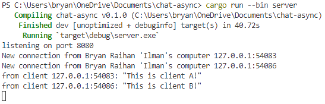
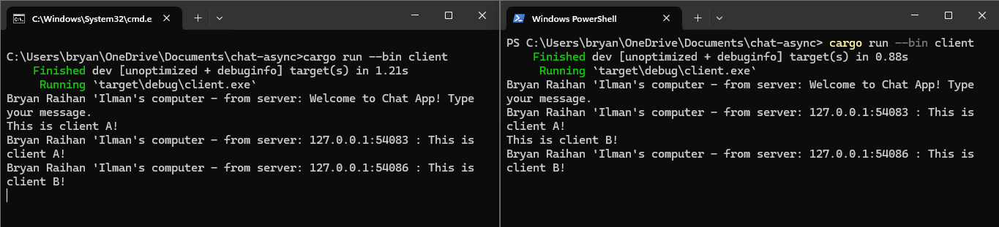

# Experiments

## 2.1. Original code of broadcast chat.

### server

### clients

Dari output, kita dapat mengamati bahwa server bertindak sebagai listener. Dengan demikian, server bisa menerima koneksi dari setiap klien. Ketika server menerima pesan baru dari sebuah klien, server akan meneruskannya kepada klien lainnya, yang disebut sebagai message forwarding. Dengan kata lain, server melakukan broadcast atas pesan yang diterimanya. Ini menunjukkan bahwa server tidak hanya menerima, tetapi juga menyebarkan informasi di antara klien-klien yang terhubung.

## 2.2. Modifying the websocket port

Apabila kita mengubah port server dan client menjadi sama, aplikasi dapat berjalan dengan baik. Hal ini karena keduanya akan saling terhubung pada port yang sama, sehingga tidak ada masalah dalam proses komunikasi. Namun, jika port yang digunakan oleh client dan server tidak sama, maka aplikasi akan mengalami kesulitan dalam berkomunikasi. Hal ini karena client akan mencoba terhubung ke server pada port yang telah ditentukan. Jika port tersebut tidak cocok dengan port yang digunakan oleh server, maka akan muncul error.

## 2.3. Small changes. Add some information to client.

### server

### clients

Saya menambahkan bcast_tx.send(format!("{addr} : {text}"))?; agar aplikasi dapat mengirim pesan siaran broadcast dengan format yang mencakup alamat asal dan teks. Dengan demikian, setiap klien dapat menerima informasi dari setiap alamat klien lainnya. Ini memungkinkan semua klien dalam aplikasi untuk mengetahui asal pesan. Selain itu, saya juga menambahkan `println!("New connection from Bryan Raihan 'Ilman's computer {addr:?}");` pada kode server untuk memberikan informasi tambahan ketika koneksi baru ke server terjadi. Dengan demikian, asal dari setiap koneksi yang terjadi dalam server dapat dilihat.
